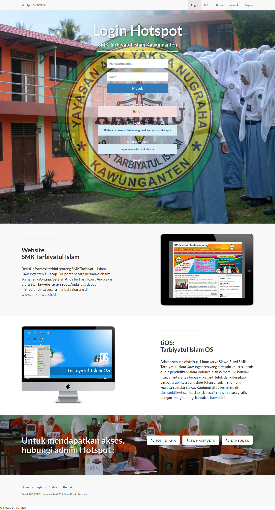

# Login Mikrotik Hotspot SMK TI Kawunganten 

dibuat dengan [Start Bootstrap](http://startbootstrap.com/) - [Landing Page](http://startbootstrap.com/template-overviews/landing-page/)

## Memulai

Untuk menggunakan template ini, ikuti langkah berikut:
* Salin seluruh repositori ini ke dalam routerboard melalui ftp
* Silahkan fork repository ini sesuka hati Anda

## Screenshot

## Dibuat oleh

Template login Hostpot ini dibuat dan dikelola oleh **Samsul Ma'arif**.

* https://twitter.com/samsulmaarif_
* https://github.com/samsulmaarif
* https://fb.com/samsul.web.id
* https://www.instagram.com/samsul.web.id

Dibuat berdasarkan framework [Bootstrap](http://getbootstrap.com/) yang dibuat oleh [Mark Otto](https://twitter.com/mdo) and [Jacob Thorton](https://twitter.com/fat).

## Copyleft and License

Copyleft 2016 Samsul Ma'arif. Dirilis dengan lisensi MIT.
